# StudyStar

StudyStar is a web-based study tracker designed to help learners plan, track, and reflect on their educational progress. The platform allows users to create courses, set personalised goals, log study sessions, and visualise their progress through clean, data-driven charts. StudyStar supports learners in building consistent study habits while offering a clear overview of their workload and achievements.

Users can log a study session by selecting a course, adding a duration, optional notes, and choosing a date and time. StudyStar then aggregates all study data to display helpful insights, including progress toward goals, total hours completed, weekly streaks, and motivational milestones.

A space-themed achievement system rewards users for key milestones — such as hitting hour targets, completing goals, and maintaining weekly streaks — helping learners stay motivated throughout their study journey.

Instructions are provided throughout the platform to guide users, and authenticated users can view, edit, or delete their courses, goals, and sessions. A dedicated contact page allows users to send questions, feedback, or suggestions directly through the app.

Visit the deployed website here: [Insert link once deployed].

## Table of Contents

- [User Experience (UX)](#user-experience-ux)
    - [Project Goals](#project-goals)
- [User Goals](#user-goals)
- [Structure](#structure)
- [Entity Relationship Diagram](#entity-relationship-diagram)
- [Wireframes](#wireframes)
- [Colour Scheme](#colour-scheme)
- [Typography](#typography)
- [Features](#features)
    - [General](#general)
    - [Home Page](#home-page)
    - [Dashboard](#dashboard) 
    - [Courses](#courses)
    - [Goals](#goals)
    - [Study Sessions](#study-sessions)
    - [Achievements](#achievements)
    - [Contact](#contacts)
    - [User Accounts](#user-accounts)
- [Technologies Used](#technologies-used)
    - [Languages Used](#languages-used)
    - [Libraries and Frameworks](#libraries-frameworks)
    - [Django Packages and Dependencies](#django-packages-dependencies)
    - [Database Management](#database-management)
    - [Tools and Programs](#tools-programmes)
- [Testing](#testing)
- [Deployment](#deployment)
    - [Deploying on Heroku](#deploying-on-heroku)
- [Finished Product](#finished-product)
- [Reflections](#reflections) 
    - [Future Features](#future-features)
- [Credits](#credits)
    - [Content](#content)
    - [Media](#media)

## User Experience (UX)

### Project Goals

- StudyStar is designed to deliver a clean, intuitive experience that helps users take control of their learning. The primary project goals are:
- Provide a structured way for users to create and manage courses.
- Allow users to set weekly or long-term study goals with clear progress tracking.
- Enable fast, simple logging of study sessions with optional notes and timestamps.
- Offer meaningful data visualisation using Chart.js, including weekly progress, streaks, and long-term trends.
- Reward user progress through a fun achievement system with space-themed badges.
- Require user authentication for all course, goal, and session management, tying all data to the correct user.
- Provide a responsive, mobile-first interface for tracking progress on any device.
- Offer a clean contact form so users can ask questions or provide suggestions.

## User Goals

1. **Create and manage courses
    As a Site User I want to add and edit my courses so that I can organise the subjects or topics I’m currently studying.

2. **Set personalised study goals
    As a Site User I want to define weekly or long-term goals so that I have clear targets to work towards.

3. **Log study sessions quickly
    As a Site User I want to record my study duration, notes, and course selection so that I can keep an accurate track of my learning.

4. **View my study progres
    As a Site User I want to see my logged hours, completed lessons, and overall progress so that I can understand how I’m doing.

5. **Track trends and streaks
    As a Site User I want to view charts showing my weekly progress and streaks so that I can stay motivated and maintain consistency.

6. **Earn achievements
    As a Site User I want to earn badges for milestones like completed goals or study streaks so that I feel rewarded for my efforts.

7. **Edit or delete my data
    As a Site User I want to update or remove courses, goals, or sessions so that I can keep my records accurate.

8. **Access the app on any device
    As a Site User I want the website to work on both desktop and mobile so that I can log sessions wherever I study.

9. **Use a secure, account-based system
    As a Site User I want my study data to be tied to my account so that only I can view and manage it.

10. **Contact the site owner
    As a Site User I want to message the site owner so that I can ask questions, share feedback, or make suggestions.

## Structure

The structure of the StudyStar website is shown in the diagram below. After logging in, users land on the dashboard, which acts as the central hub for accessing their courses, goals, achievements, and study session tools. From the Courses section, users can view all of their courses, add new ones, or open a course detail page where individual study sessions can be logged directly. The Goals area allows users to track their progress through charts and goal tabs, as well as create new goals. A dedicated Achievements page displays all earned badges to help motivate consistent study habits. Core actions such as adding a course, creating a goal, or logging a session each have their own dedicated form pages. This structure ensures that users can navigate intuitively between their study data, add new information easily, and explore their overall progress with minimal friction.

Note that:

- The header, footer, and navigation menu are the same
on all pages.
- Logged in users will have a side navigation menu to access user areas.
- Links, buttons and form provide clear feedback to the user.
- Users can add, edit, delete and view their goals and courses after creating an account.
- There is a custom 404 error page.

