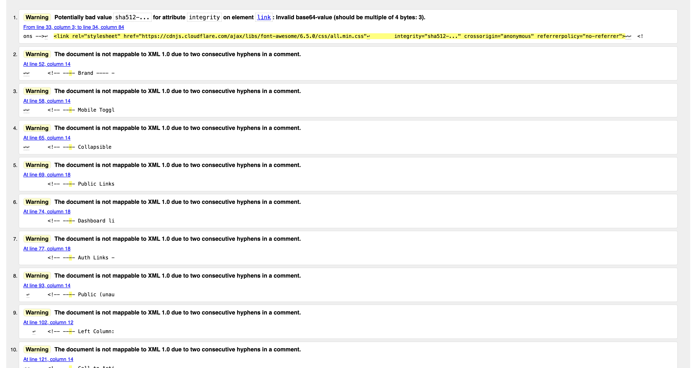
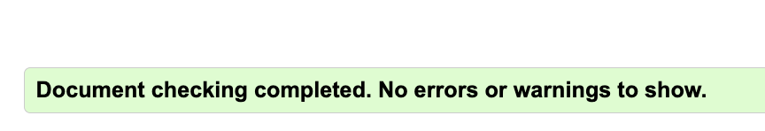
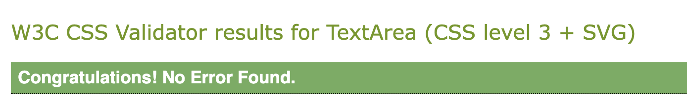
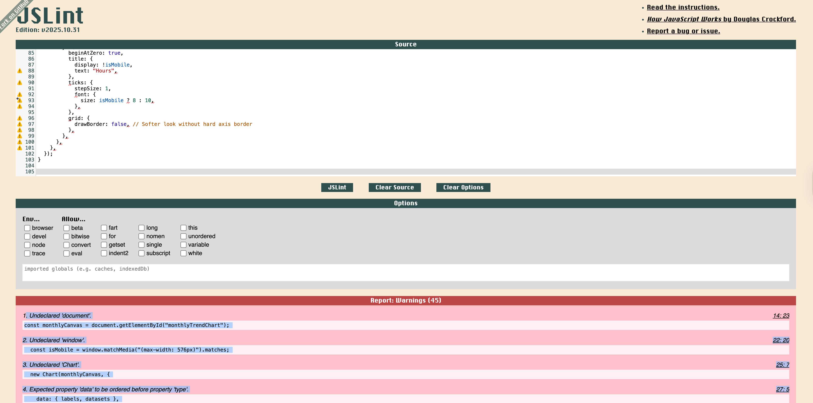
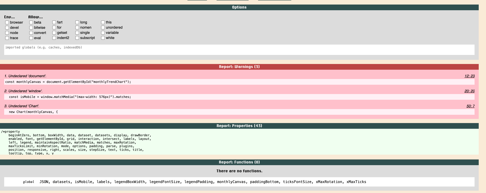
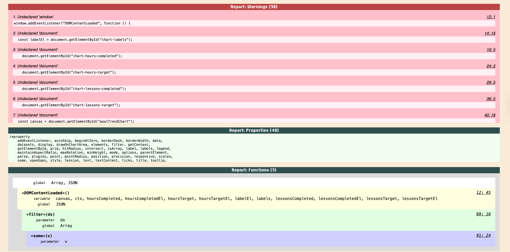
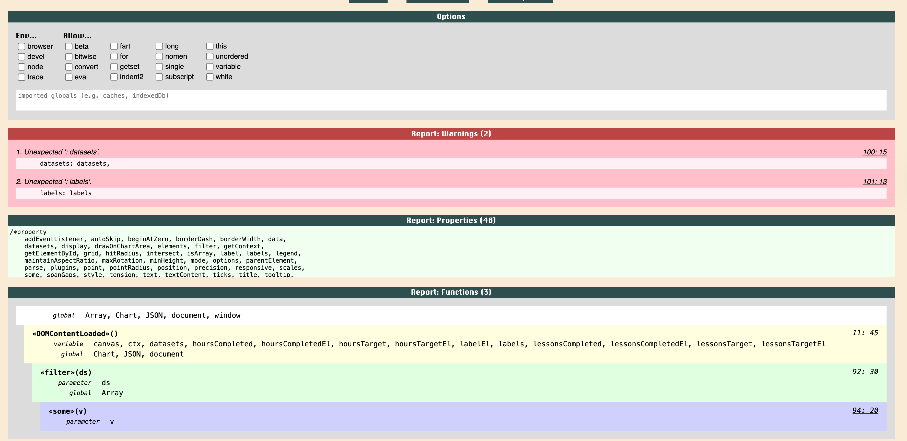
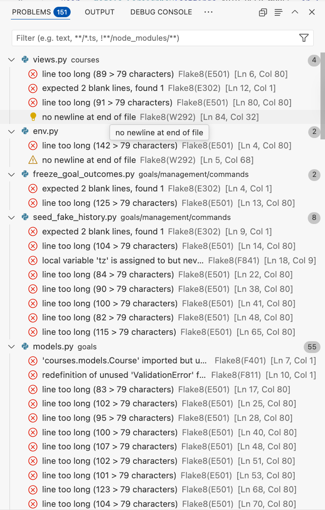
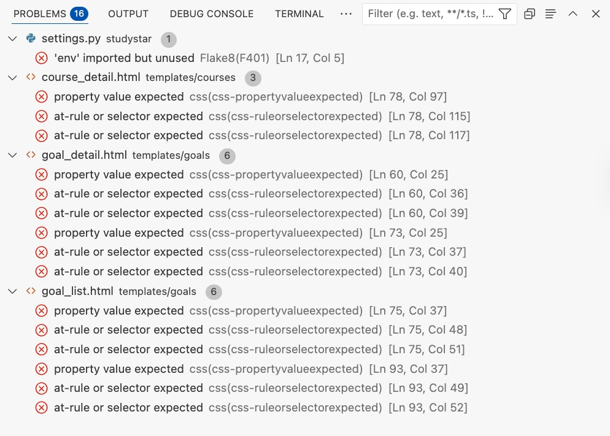

# StudyStar Testing

[Back to the README.md file](https://github.com/TereBts/py_study_tracker/blob/main/README.md)

[Back to the Testing section in the README.md file](https://github.com/TereBts/py_study_tracker#testing)

[View the live website here](https://studystar-tracker-4c939321ffcd.herokuapp.com/)  

## Table of Contents

- [Testing User Stories](#testing-user-stories)
- [Manual Testing](#manual-testing)
- [Code Validation](#code-validation)
- [Accessibility](#accessibility)
- [Tools Testing](#tools-testing)

## Testing User Stories

1. **Create and manage courses**
    As a Site User I want to add and edit my courses so that I can organise the subjects I am studying.

    **Acceptance Criteria**

    - A “Courses” page is available after logging in.
    - An Add Course form is accessible from the Courses page.
    - Submitting the form creates a new course linked to the logged-in user.
    - Courses appear in the Courses list after creation.
    - Users can edit an existing course and see the updated information.
    - Users can delete a course from its confirmation page.

2. **Set personalised study goals**
    As a Site User I want to define weekly or long-term goals so that I have clear targets to work towards.

    **Acceptance Criteria**

    - A “Goals” page displays all goals linked to the user.
    - An Add Goal form allows users to create goals for a selected course.
    - Validation ensures goal values fall within valid ranges (e.g., study days 1–7).
    - New goals appear in the Goals list after submission.

3. **Log study sessions quickly**
    As a Site User I want to record my study duration, notes, and course selection so that I can keep an accurate track of my learning.

    **Acceptance Criteria**

    - A Log Study Session form is available from the dashboard, courses, and goals.
    - Required fields validate correctly (e.g., duration must be > 0).
    - Submitting the form saves the session and displays a success message.
    - Logged sessions appear immediately in the Study Session List.

4. **View my study progress**
    As a Site User I want to see my logged hours and progress so that I can understand how I’m doing.

    **Acceptance Criteria**
    - The dashboard displays total hours, streaks, and achievements.
    - The Goals page shows progress bars or percentages for each goal.
    - Course pages list associated sessions or stats.
    - Data updates instantly after logging a new session.

5. **Track trends and streaks**
    As a Site User I want to view charts showing my weekly progress and streaks so that I can maintain consistency.
    
    **Acceptance Criteria**
    - Weekly trend charts load without errors.
    - Charts update when new sessions are logged.
    - Streak counters update based on consecutive study days/weeks.
    - Projected finish dates appear when enough data exists.

6. **Earn achievements**
    As a Site User I want to earn badges for milestones so that I feel rewarded for my efforts.
    
    **Acceptance Criteria**
    - The Achievements page is accessible via the sidebar.
    - Milestone badges appear once criteria are met (e.g., total hours, streaks).
    - Newly earned badges show immediately after progress updates.
    - Achievement icons load correctly across devices.

7. **Edit or delete my data**
    As a Site User I want to update or remove courses, goals, or sessions so that my records remain accurate.
    
    **Acceptance Criteria**
    _ Edit buttons are available on Course Detail, Goal Detail, and Session pages.
    - Changes persist immediately after saving.
    - Delete actions redirect to a Confirm Delete Page.
    - Deleted items no longer appear in lists.

8. **Use the platform on any device**
    As a Site User I want the website to work on both desktop and mobile so that I can log sessions wherever I am.

    **Acceptance Criteria**
    - All pages are fully responsive across mobile, tablet, and desktop.
    - Forms resize gracefully and remain readable on small screens.
    - Sidebar converts to a hamburger menu on mobile.
    - Charts scale correctly on smaller devices.

9. **Secure, account-based access**
    As a Site User I want my data to be protected and linked only to my account.

    **Acceptance Criteria**
    - Users must log in to view or manage courses, goals, and sessions.
    - Attempting to access another user’s data returns a 403 or redirect.
    - Account features (login, logout, password reset) work as intended.
    - Secure password rules and validations are in place.

10. **Contact the site owner**
    As a Site User I want to send messages for help or feedback.

    **Acceptance Criteria**
    - A Contact page is available from the main menu.
    - A form collects name, email, and message fields.
    - Submitting the form stores the message and shows a confirmation.
    - Invalid submissions display appropriate error messages.

## Manual Testing

* Browser Compatibility

Browser | Outcome | Pass/Fail  
--- | --- | ---
Google Chrome | No appearance, responsiveness nor functionality issues.| Pass
Mozilla Firefox | No appearance, responsiveness nor functionality issues. | Pass
Microsoft Edge | No appearance, responsiveness nor functionality issues. | Pass

* Device compatibility

Device | Outcome | Pass/Fail
--- | --- | ---
Lenovo Legion Slim 7 | No appearance, responsiveness nor functionality issues. | Pass
iPad Pro 11" | No appearance, responsiveness nor functionality issues. | Pass
Samsung Galaxy Ultra 22 | No appearance, responsiveness nor functionality issues. | Pass

* Deployment Testing (Heroku & GitHub)

The following tests were performed to confirm successful deployment and correct functionality in the live Heroku environment.Testing focused on verifying that the deployed app behaved identically to the local version, with all environment variables and database connections working as intended.
| Test | Action / Input | Expected Result	Actual Result| Pass/Fail |
| --- | --- | --- | --- | 
| GitHub connection | Push project to GitHub repository | Code uploads successfully and appears in the main branch | Repository updated correctly | Pass |
| Heroku app creation | Create new Heroku app and link to GitHub repository | Heroku app connects to GitHub successfully	Connection confirmed | Pass |
| Database connection | Configure DATABASE_URL and run python3 manage.py migrate on Heroku	Database tables created successfully | Migrations applied without error | Pass |
| Environment variables	Add SECRET_KEY and DATABASE_URL to Heroku config vars | Environment variables are securely stored and loaded | Variables load correctly | Pass |
| Site configuration | Add correct domain in Django admin “Sites” section | Domain matches deployed URL	Domain configured successfully | Pass |
| Deployment build	Deploy via Heroku GitHub integration | Build completes with no errors | Deployment successful | Pass |
| App launch | Visit deployed app URL | Site loads correctly with all pages accessible	Pages render as expected | Pass |
| Authentication check | Test signup, login, logout, and tracker redirect on live app	Same behaviour as local environment | Auth functions correctly | Pass |
| Static files | Verify CSS and template styling load on Heroku | All static files load properly | Styling renders correctly | Pass |

Manual Testing Summary:
    The application deployed successfully to Heroku using GitHub integration.All environment variables were correctly configured, and the PostgreSQL database connected without issues.User authentication, redirects, and protected views were fully functional in the deployed environment.No deployment-specific bugs were encountered after initial setup of the SITE_ID and environment variables.

* Goal Record Freeze Test

This test verifies that the weekly goal record freezing system works correctly.It ensures that each Monday, when a user visits their goal detail page, StudyStar automatically creates (or updates) a GoalOutcome entry for the previous week — capturing total study hours and lessons completed.
This helps guarantee that users always have an accurate history of their study progress without needing any manual updates or scheduled jobs.

This test simulates the full process of a weekly freeze and verifies:
1. Weekly calculation and record creation
    * A fake user, course, goal, and study sessions are created.
    * The date is “frozen” to a Monday morning so that the automatic freeze logic triggers.
    * When the goal detail view is accessed, the app calls freeze_weekly_outcomes() to record the previous week’s totals.
    * The test confirms that a new GoalOutcome row is created for that week.
2. Accurate progress tracking
    * The study sessions total 120 minutes (2.0 hours).
    * The test checks that this total is stored correctly in the GoalOutcome.hours_completed field and marked as “completed” because it meets the goal’s weekly target (1.5 hours).
3. Idempotency (safe to run multiple times)
    * The view is accessed a second time, and the test verifies that no duplicate record is created.
    * This ensures the function can safely run repeatedly without double-counting progress.

How the Test Works
* Uses Django’s built-in TestCase class, which creates an isolated test database.
* Uses unittest.mock.patch() to “pretend” the current date is a Monday, allowing the freeze logic to execute immediately.
* Populates the database with a user, course, goal, and two study sessions.
* Loads the goal detail view via Django’s Client (simulating a real browser request).
* Asserts that the correct GoalOutcome is created and that repeated requests do not duplicate results.

Running the Test
From your project root (where manage.py lives):

python manage.py test goals.tests.test_freeze_on_view
You should see output like:

Creating test database for alias 'default'...
System check identified no issues (0 silenced).
.
----------------------------------------------------------------------
Ran 1 test in 1.468s

OK
Destroying test database for alias 'default'...
This confirms that the weekly freeze system and goal record tracking are functioning as intended.

This test ensures the reliability of one of StudyStar’s most important user features — accurate weekly goal tracking.By confirming that weekly records are automatically stored and protected from duplication, it prevents data errors and guarantees a consistent progress history for every user.

Developer Notes
* Location of Logic: The weekly freeze logic lives in goals/services.py within the freeze_weekly_outcomes() function.It aggregates StudySession data from the previous week, converts minutes to hours, and stores totals in a new GoalOutcome record.
* Trigger Point:The GoalDetailView in goals/views.py calls this function each time the goal detail page is loaded.The function checks whether it’s Monday (Europe/London timezone) before writing new records, so it only freezes last week’s data once per week.
* Idempotent Design:The update_or_create() method in the service ensures that if a record for that goal/week already exists, it’s updated — not duplicated.This is why the test verifies both creation and idempotency.
* Why the Test Uses Mock Dates:In production, the freezer only runs automatically on Mondays.To verify the feature anytime, the test uses unittest.mock.patch() to temporarily replace Django’s timezone.now() with a fixed Monday morning date.This triggers the same logic in a controlled environment.
* Extending Tests Later:Future tests could simulate multiple weeks of data, goals with lesson-based targets, or users who skip a week to ensure historical continuity.

* Elements Testing

**Common Elements**

Feature | Outcome | Pass/Fail
--- | --- | ---
Navigation Bar | Link is working as expected. | Pass
Menu | Links are working as expected. | Pass
Side Bar Menu | Links are working as expected. | Pass
Button hover effects | Changes colour on hover, cursor changes to pointer | Pass |
Footer | Hover effects and social media links are working as expected. | Pass

**Home Page**

| Feature | Outcome | Pass/Fail |
|---|---|---|
| Hero image | Visible at the top of the page | Pass |
| Hero section cover title | Cover text is visible at the top of the page on the hero image | Pass |
| Call to action buttons (Not logged in)  | Sign In and Create Account buttons appear for unauthenticated users and on click work as expected | Pass |
| Responsive layout | Content stacks and remains readable on mobile and tablet viewports | Pass

**Dashboard**

| Feature | Outcome | Pass/Fail |
|---|---|---|
| Dashboard header | Page title and brief intro text are visible at the top of the page | Pass |
| Quick action buttons | Buttons to log a session / add course / add goal are visible and navigate to correct forms | Pass |
| Summary cards | Key stats (e.g. total hours, active goals, streaks) are displayed and update after logging sessions | Pass |
| Progress chart | Weekly or monthly trend chart renders without error and updates after new data is added | Pass |
| Achievements preview | Recently earned achievements or badges are visible with correct icons | Pass |
| Responsive layout | Content stacks and remains readable on mobile and tablet viewports | Pass |

**Courses Page**

| Feature | Outcome | Pass/Fail |
|---|---|---|
| Courses list | All courses for the logged-in user are displayed in a list or card layout | Pass |
| No courses message | A clear message and link to add a course are shown if no courses exist | Pass |
| Add Course button | Button is visible and navigates to the Add Course form | Pass |
| Course links | Clicking a course name navigates to the Course Detail page | Pass |
| Status display | Course status (e.g. Active/Completed) is visible and matches stored data | Pass |
| Responsive layout | Courses list adjusts correctly on smaller screens	Pass |

**Course Detail Page**

| Feature | Outcome | Pass/Fail |
|---|---|---|
| Course information | Title, provider, description, dates, and colour are displayed correctly | Pass |
| Associated goals | Any goals linked to this course are listed or summarised | Pass |
| Log Session button | Visible and navigates to the Log Study Session form pre-selecting this course (if implemented) | Pass |
| Edit / Delete buttons | Buttons navigate to the appropriate edit and delete confirmation views | Pass |
| Back to Courses link | Returns user to the Courses list | Pass |
| Responsive layout | Page content is readable and well-structured on mobile devices | Pass |

**Add Course Form**

| Feature | Outcome | Pass/Fail |
|---|---|---|
| Form display | Add Course form loads with fields for title, description, dates, status, and colour | Pass |
| Required fields | Validation prevents submission when required fields (e.g. title) are empty | Pass |
| Date inputs | Start and end dates use HTML5 date pickers and accept valid dates only | Pass |
| Colour selection | Colour field options are visible and selectable | Pass |
| Status selection | Status choices (e.g. Active / Completed) are available and save correctly | Pass |
| Successful submission | Submitting a valid form creates a new course linked to the logged-in user | Pass |
| Redirect behaviour | After creation, user is redirected to Courses or Course Detail page as expected | Pass |
| Success message | Confirmation message is displayed after a successful submission | Pass |
| Error handling | Invalid or incomplete submissions show helpful error messages | Pass |
| Responsive layout | Form is fully usable and readable on mobile, tablet, and desktop | Pass |

**Goals Page**

| Feature | Outcome | Pass/Fail |
|---|---|---|
| Goals list | All goals for the logged-in user are displayed with key summary info | Pass |
| No goals message | Message and link to Add Goal appear when the user has no goals | Pass |
| Add Goal button | Visible and navigates to the Add Goal form | Pass |
| Progress indicators | Progress bars or percentages are displayed and match stored data | Pass |
| Links to Goal Detail | Clicking a goal opens the corresponding Goal Detail page | Pass |
| Responsive layout | Goals list displays correctly on mobile and tablet | Pass |

**Goal Detail Page**

| Feature | Outcome | Pass/Fail |
|---|---|---|
| Goal details panel | Course, weekly targets, study days, daily targets, milestone, and total required lessons are displayed | Pass |
Progress overview | Weekly progress and overall completion percentage are calculated and shown correctly | Pass |
| Milestone messaging | Messages for weekly goal completion and milestone achievement appear when criteria are met | Pass |
| Projected finish date | Projected date is shown when enough data exists | Pass |
| Weekly trend chart | Chart renders without errors and updates as new sessions are logged | Pass |
| History table | Past weekly outcomes are listed with correct hours, lessons, and completion flags | Pass |
| Edit / Delete / Back buttons | Buttons navigate to edit form, delete confirmation, and Goals list respectively | Pass |

**Add Goal Form**

| Feature | Outcome | Pass/Fail |
|---|---|---|
| Form display | Add Goal form loads with fields for course, weekly targets, study days, total lessons, milestone name/date | Pass |
| Course dropdown | Course field lists only courses belonging to the logged-in user | Pass |
| Required fields | Validation prevents submission when required fields (e.g. course, at least one target, study days) are empty | Pass |
| Study days validation | Study days per week must be between 1 and 7; invalid values show errors | Pass |
| Weekly targets | Weekly hours and lessons targets accept only numeric values | Pass |
| Milestone fields | Milestone name and date fields accept valid text/date input and can be left optional | Pass |
| Successful submission | Submitting a valid form creates a new goal linked to the selected course and user | Pass |
| Redirect behaviour | After creation, user is redirected to the Goals page or Goal Detail page as expected | Pass |
| Success message | Confirmation message is shown after a successful submission | Pass |
| Error handling | Invalid or missing data triggers clear inline error messages | Pass |
| Responsive layout | Form is easy to use and read on mobile, tablet, and desktop | Pass |

**Study Session List Page**

| Feature | Outcome | Pass/Fail |
|---|---|---|
| Session table | Study sessions for the logged-in user are displayed in a list/table | Pass |
| Columns and data | Date, course, duration, and notes are shown and match stored data | Pass |
| Order of sessions | Sessions are ordered with most recent at the top	Pass |
| Log New Session button | Visible and navigates to the Log Study Session form | Pass |
| No sessions message | Informative message and link to create first session appear when none exist | Pass |
| Responsive layout | Table or | list adapts correctly to smaller screens | Pass
| Pagination (if used) | Moving between pages works correctly without errors | Pass
| Responsive layout | Table or list adapts correctly to smaller screens | Pass |

**Log Study Session Form**

| Feature | Outcome | Pass/Fail |
|---|---|---|
| Form display | Form loads with fields for course, goal (optional), start time, duration, and notes | Pass |
| Required fields | Validation prevents submission when required fields are empty or invalid | Pass |
| Course selection | Course dropdown lists only the user’s own courses | Pass
| Duration validation | Duration must be greater than zero; errors shown otherwise | Pass |
| Success feedback | Successful submission redirects and displays a confirmation message | Pass |
| Data persistence | New session appears in the Study Session List and updates related progress | Pass |
| Responsive layout | Form is usable and readable on mobile devices | Pass |

**Achievements Page**

| Feature | Outcome | Pass/Fail |
|---|---|---|
| Achievements list/grid | All earned achievements for the user are displayed | Pass |
| Badge icons | Icons or images are visible and match the achievement type | Pass |
| Titles and descriptions | Each achievement shows a clear title and explanation | Pass |
| Newly earned badges | Recently earned achievements appear after targets are met | Pass |
| No achievements message | Friendly message displays if the user has not yet earned any achievements | Pass |
| Responsive layout | Achievements display correctly on different screen sizes | Pass |

**Contact Page**

| Feature | Outcome | Pass/Fail |
|---|---|---|
| Contact form | Form with name, email, and message fields is visible | Pass |
| Validation | Required fields must be completed and validated before submission | Pass |
| Submission behaviour | Submitting a valid form stores a ContactMessage and shows a success message | Pass |
| Error handling | Invalid submissions display appropriate error messages | Pass |
| Navigation | Link or button to return to main app sections (e.g. Dashboard) works correctly | Pass |
| Responsive layout | Form and content are easy to read and use on mobile devices | Pass |

**Sign Up (Create Account)**

| Feature | Outcome | Pass/Fail |
|---|---|---|
| Form display | Registration form loads with fields for name, email, and password | Pass |
| Required fields | Validation prevents submission when required fields are empty | Pass |
| mail validation	Invalid or duplicate email addresses trigger error messages | Pass |
| Password validation | Password meets required criteria; weak passwords trigger warnings | Pass |
| Successful submission | Valid form submission creates a new user account | Pass |
| Redirect behaviour | User is redirected to a confirmation or login page after signing up | Pass |
| Success message | A clear confirmation message is shown after successful registration | Pass |
| Error handling | Incorrect or missing data shows inline errors | Pass |
| Responsive layout | Form is readable and easy to complete on all screen sizes | Pass |

**Sign In**

| Feature | Outcome | Pass/Fail |
|---|---|---|
| Form display | Login form loads with email/username and password fields | Pass |
| Required fields	Validation prevents submission when fields are empty | Pass |
| Invalid credentials | Incorrect username/password shows an appropriate error message | Pass |
| Successful login | Valid credentials log the user in successfully | Pass |
| Redirect behaviour | User is redirected to Dashboard or intended page after logging in | Pass |
| Link to Sign Up | Users without an account can navigate to the registration page | Pass |
| Password reset link | “Forgot password” link is visible and navigates correctly | Pass |
| Responsive layout | Login form adapts correctly on mobile and tablet layouts | Pass |

**Forgot Password**

| Feature | Outcome | Pass/Fail |
|---|---|---|
| Forgot password page visible | "Password Reset" heading and instructions are displayed | Pass |
| Email input field present | Email input field is visible and enabled | Pass |
| CSRF protection | CSRF token is present in the form | Pass |
| Reset button present | "Reset My Password" button is visible and enabled | Pass |
| Form validation | Invalid submissions show error messages and do not submit | Pass |
| Password reset email sent | Password reset email is sent to the user if email exists | Pass |
| Success message | Confirmation message is displayed after submitting the form | Pass |
| Password reset link works | Clicking the link in the email opens the password reset form | Pass |
| New password form validation | New password form validates input and shows errors if invalid | Pass |
| Successful password reset | User can set a new password and log in with it | Pass |

**Log Out**

| Feature | Outcome | Pass/Fail |
|---|---|---|
| Log out link/button | Log Out option is visible in the navigation or sidebar | Pass |
| Confirmation page | User is shown a confirmation prompt before logging out | Pass |
| Confirm button | Clicking the confirmation button logs the user out successfully | Pass |
| Cancel button | Cancel returns the user to the previous page without logging out | Pass |
| Redirect behaviour | After logging out, the user is redirected to the Login or Home page | Pass |
| Success message | “You have logged out successfully” message appears | Pass |
| Access restriction | Logged-out users cannot access authenticated pages (redirect to Sign In) | Pass |
| Responsive layout | Confirmation page and buttons display correctly across devices | Pass |

### HTML

The [W3C Markup Validator](https://validator.w3.org/) was used to validate the project HTML code to ensure there were no syntax errors.

To validate my HTML, I used the browser’s View Page Source output rather than the raw Django template files. Django templates contain tags such as , , and , which are not valid HTML and therefore cannot be processed by the W3C validator directly. To ensure accurate validation, I opened each rendered page in the browser, viewed the compiled HTML source (the version after Django merges the template with base.html), and copied that HTML into the W3C validator. This allowed me to validate the actual output sent to the browser, rather than the Django-specific template syntax.
 
W3C Markup Validator found the following errors for the home page:

The errors were solved by:
 * Removing "----" inside the html comments.
 * Ensuring all sections had a hidden H2 heading

There were similar errors found in the html template pages where I had placed multiple dashes in the html comments and no heading text for sections, after I adjusted all of these the errors were resolved. 

### CSS

[W3C CSS Validator](https://jigsaw.w3.org/css-validator/) service was used to validate the CSS code to ensure there were no syntax errors. 

No errors were found. 

### JavaScript

[JSLint](https://jslint.com/) was used to validate the JavaScript code. 

JSLint found the following errors for the Monthly Trend Chart Javascript file:

During development, a small number of lint warnings were generated in the JavaScript file responsible for rendering the monthly trend chart. These warnings related to the use of document, window, and Chart being flagged as undeclared variables. In this case, all three are intentional global objects provided by the browser and the imported Chart.js library. Because these globals are required for the script to function and are not defined within the JavaScript module itself, the linter reports them even though they are valid in the browser execution environment. Multiple approaches (including declaring globals and enabling browser environments through lint directives) were tested, but due to the specific linting configuration used by the Code Institute template, the warnings persist. As the functionality is correct, secure, and expected for a front-end script running in the browser, these warnings can be safely ignored.

JSLint found the following errors for the Goal Trend Chart Javascript file:

Goal Trend Chart – Remaining Lint Warnings
The JavaScript used for the Goal Trend Chart triggers a small number of remaining warnings from the JSLint configuration bundled with the Code Institute template. These are mainly related to the use of browser globals (window, document, Chart) and strict expectations around object key ordering inside configuration objects passed to Chart.js. In this context, all of these globals are intentional: window and document are provided by the browser, and Chart is provided by the Chart.js library loaded via CDN. The object key ordering warnings are purely stylistic and do not affect functionality, and changing them to satisfy JSLint can actually reduce readability of the Chart.js configuration. The script behaves correctly in the browser, safely parses JSON from <script type="application/json"> tags, and renders the expected dual-axis chart. For these reasons, the remaining JSLint warnings are accepted and documented here rather than forcing additional changes that would not improve the code’s behaviour or safety.
If you like, you can then add a single line like:
The same rationale applies to the monthly trend chart script, which also relies on these browser and Chart.js globals.

### Python

All Python code was validated using Flake8, which integrates directly inside VS Code, allowing instant feedback while coding. I chose Flake8 because it highlights PEP 8 style issues and unused imports in real time, making it easier to maintain clean, consistent code throughout development.
All major issues (such as indentation, spacing, and long lines) were corrected.

A few minor warnings were intentionally ignored, with justification below:
    * env imported but not used:This line (if os.path.isfile('env.py'): import env) is used to load environment variables locally during development. Although the import isn’t directly referenced, it allows local configuration values (like SECRET_KEY and DATABASE_URL) to be loaded safely before deployment. It does not affect production performance or functionality, so it was left in place.
    * CSS / HTML template warnings (e.g. “property value expected”, “identifier expected”):These appear because Django template syntax (e.g. {{ variable }}) is not valid CSS/HTML until the template is rendered. Since these lines display correctly in the browser and are not actual syntax errors, they were safely ignored.

All other PEP 8 issues were resolved, and the project passed validation with no critical errors.

## Accessibility

Lighthouse in Chrome DevTools was used to confirm that the colours and fonts used 
in the website are easy to read and accessible. See reports in the table below:

<table>
  <thead>
    <tr>
      <th>Page</th>
      <th>Lighthouse Report</th>
    </tr>
  </thead>
  <tbody>
    <tr>
      <td>Home</td>
      <td></td>
    </tr>
    <tr>
      <td>About</td>
      <td></td>
    </tr>
    <tr>
      <td>Contact</td>
      <td></td>
    </tr>
    <tr>
      <td>Sign In</td>
      <td></td>
    </tr>
    <tr>
      <td>Sign Up</td>
      <td></td>
    </tr>
    <tr>
      <td>Log Out</td>
      <td></td>
    </tr>
    <tr>
      <td>Dashboard</td>
      <td></td>
    </tr>
    <tr>
      <td>Courses</td>
      <td></td>
    </tr>
    <tr>
      <td>Course Details</td>
      <td></td>
    </tr>
    <tr>
      <td>Add Course Form</td>
      <td></td>
    </tr>
    <tr>
      <td>Goals</td>
      <td></td>
    </tr>
    <tr>
      <td>Goal Details</td>
      <td></td>
    </tr>
    <tr>
      <td>Goal Form</td>
      <td></td>
    </tr>
    <tr>
      <td>Session List</td>
      <td></td>
    </tr>
    <tr>
      <td>Session Form</td>
      <td></td>
    </tr>
    <tr>
      <td>Session Delete</td>
      <td></td>
    </tr>
    <tr>
      <td>Session Delete</td>
      <td></td>
    </tr>
    <tr>
      <td>404 Error</td>
      <td></td>
    </tr>

<tr>
      <td>Session Delete</td>
      <td></td>
    </tr>

## Tools Testing

### [Chrome DevTools](https://developer.chrome.com/docs/devtools/)

Chrome DevTools was used during the development process to test, explore and modify HTML elements and CSS styles used in the project.

### Responsiveness

* [Am I Responsive?](http://ami.responsivedesign.is/#) was used to check responsiveness of the site pages across different devices.

* Chrome DevTools was used to test responsiveness on different screen sizes during the development process.